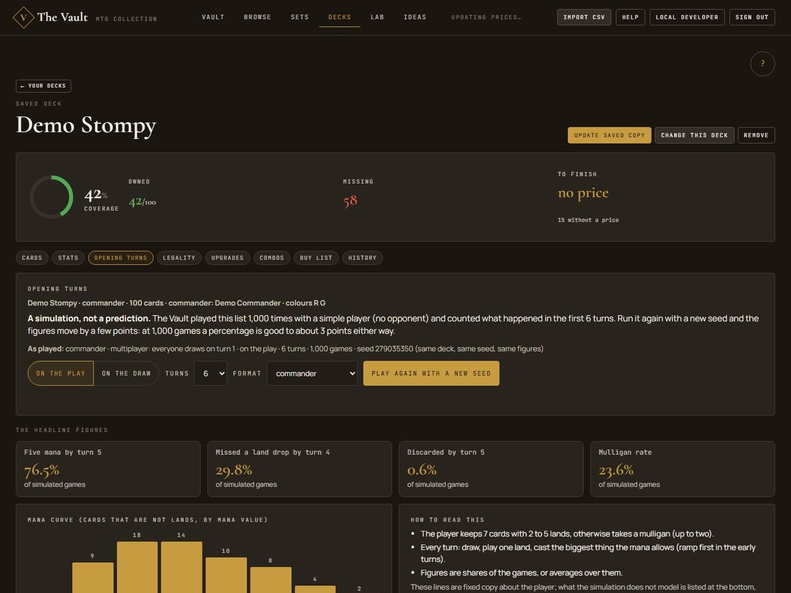
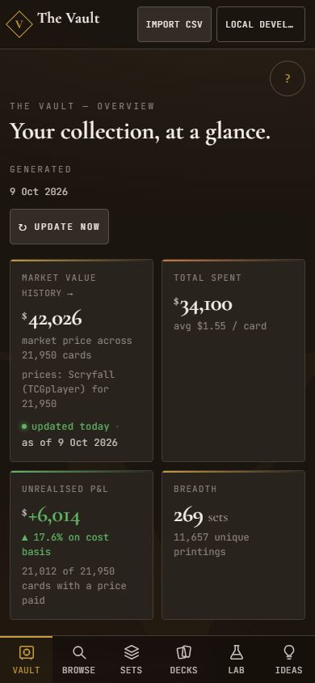
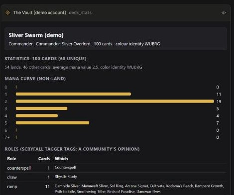

# The Vault

**Your Magic: The Gathering collection, decks and prices in one place, and an assistant that answers from the real data, with its sources shown.**

[Open the Vault](https://mtgvault.cards) · [Connect your assistant](https://mtgvault.cards/connect.html) · Free and unofficial

## What you can do

- **See what your collection is worth.** Market value today, how it moved over the last year, what you paid, what you are up or down. On a phone as well as on a desktop.
- **Know which decks you can build.** Each deck against what you own: what is missing, what it costs to finish, and which cards two of your decks are fighting over.
- **Test a deck before you sit down.** A thousand simulated games: how often you make your land drops, how much mana you have each turn, how often you discard.
- **Ask your assistant.** Claude, ChatGPT, Perplexity or Codex can read your collection and decks, check the rules with the real text and its number, review a deck with an expert panel, and tell you what is legal. Every answer says where each fact came from.
- **Fill the gaps.** Upgrade ideas within a budget, combos you already own, cards you own that do the same job as one you are missing, and plain links to the shops (no tracking, no prices from them).
- **Keep it yours.** Private by default. Download everything or delete everything, any time.

&nbsp;&nbsp;

## Start in three steps

1. **Sign in** at [mtgvault.cards](https://mtgvault.cards) with Google, Microsoft, Apple or Facebook.
2. **Import your collection** (a Dragon Shield or Moxfield CSV, or any CSV with card, set and number).
3. **Connect your assistant** (optional): open the [Connect page](https://mtgvault.cards/connect.html), copy the one line it gives you into Claude, ChatGPT, Perplexity or Codex, and sign in when asked. To check it worked, ask it to call `whoami`.

## Try asking

- "What are my five most valuable cards?"
- "Is my Sliver deck legal in Commander? What am I missing, and what does it cost to finish?"
- "Review my deck with the expert council. I want to tune it."
- "My 5/5 trampler is blocked by a 2/2 with protection from green. How much damage can go to the player?"
- "Which cards I own could stand in for the one I am missing?"

## Credits

The Vault is unofficial Fan Content permitted under the Fan Content Policy. Not approved or endorsed by Wizards of the Coast. Card data, images and prices are Scryfall's; the Comprehensive Rules are Wizards of the Coast's, read live and never stored; every answer shows its sources.

Who this is built on, and what the Vault sends to each

<!-- sources:start (generated by scripts/build_plugin.py from vault/sources.py; edit that file) -->

### Who this is built on, and how the Vault uses them

The Vault is a thin layer on other people's work. It never presents their material as its own: every answer carries its source, and the sources below are credited everywhere the material appears. What the Vault sends to each service is stated plainly; it never sends your name, e-mail or collection to any of them.

Full credits and licences: https://mtgvault.cards/credits.html

- **[Wizards of the Coast](https://magic.wizards.com)** (data). Magic: The Gathering itself: card names, rules text, mana symbols and art, and the Comprehensive Rules. The Comprehensive Rules are read live from Wizards' own rules page when a rules question is asked (the current edition's text file); the Vault keeps no copy of them and always says which edition it quoted. The Commander Bracket hint for a deck follows the Commander Brackets and Game Changers list Wizards publishes (read once, its limits kept in the code and re-checked every night). Card text and images reach the Vault only through Scryfall. Credit: Magic: The Gathering and its rules, card names, mana symbols and card images are property of Wizards of the Coast LLC. The Vault is unofficial Fan Content permitted under the Fan Content Policy. Not approved/endorsed by Wizards. Portions of the materials used are property of Wizards of the Coast. ©Wizards of the Coast LLC.
- **[Scryfall](https://scryfall.com)** (data). Card data (names, types, mana costs, Oracle text, legalities, printings), rulings, images, set icons and daily prices. A daily job downloads Scryfall's bulk files to match your cards and store prices, and the server asks Scryfall's API for a card it does not know yet or for today's prices of your cards. Nothing about you is sent, only card names and ids. Card images and set icons load from Scryfall's image servers straight in your browser or assistant, so Scryfall sees that request. The Vault does not proxy or re-host Scryfall data, shows its dated prices as Scryfall's, and credits each card's artist. Credit: Card data, rulings, images and prices: Scryfall. The Vault is not produced by or endorsed by Scryfall.
- **[Scryfall Tagger contributors](https://tagger.scryfall.com)** (community). Role tags such as ramp, removal, card draw and sweepers, written by volunteers in Scryfall's Tagger. Downloaded with the daily Scryfall data and used to count a deck's roles. Always shown as the community's opinion with its weight, never as a rule or as the Vault's judgement. Where a card has no Tagger tag the Vault may add a role from its own written rules over the card's Oracle text, always marked as computed by the Vault, never as Scryfall's. Credit: Role tags: Scryfall Tagger, by its community of volunteers.
- **[Commander Spellbook](https://commanderspellbook.com)** (community). Known combos for a deck, written and maintained by the Commander Spellbook community. When you ask about a deck's combos, one request with the deck's card names (nothing about you) goes to Commander Spellbook's public API and the answer is shortened. The Vault stores no copy of their data. Each combo is shown as theirs with a link to its page; the list only holds combos they know, so it never proves a deck has none. Credit: Combos: Commander Spellbook and its community.
- **[Archidekt](https://archidekt.com)** (community). Public decks that people share, and the community of brewers who built them. When you paste an Archidekt deck link or ask for that deck, the server fetches that one public deck on your request (the deck id only, nothing about you) and keeps that public deck's data, so that repeat reads within ten minutes do not reach Archidekt again (copies are deleted after seven days). The Vault only reads, never writes, never searches or crawls, never uses Archidekt's per-card shop prices, and credits the deck's author and links back to the deck. Credit: Deck lists: Archidekt, by their authors. The Vault is not affiliated with or endorsed by Archidekt.
- **[Moxfield](https://moxfield.com)** (format). A collection and deck format that many players already use. The Vault reads Moxfield's CSV export and plain-text decklists that you upload or paste, and writes your collection back in the format Moxfield imports. It never connects to Moxfield or your Moxfield account and never fetches its decks. Credit: Moxfield file format. The Vault is not affiliated with or endorsed by Moxfield.
- **[Dragon Shield (Card Manager)](https://mtg.dragonshield.com)** (format). The collection export that most Vault collections start from. The Vault imports the CSV file the Dragon Shield app exports and exports your collection back in the same format. Only the file you choose is used; the Vault never connects to your Dragon Shield account. Credit: Dragon Shield export format. Dragon Shield is a trademark of Arcane Tinmen ApS. The Vault is not affiliated with or endorsed by them.
- **[TCGplayer, Cardmarket and Cardhoarder](https://scryfall.com/docs/api/cards)** (data). The marketplaces behind Scryfall's prices: US dollar prices from TCGplayer, euro prices from Cardmarket, MTGO tickets from Cardhoarder. Used only indirectly, through Scryfall's daily prices. The Vault never contacts these marketplaces, has no live price, stock or shipping from any shop, and never says which shop is cheapest. Shop links are plain search links you open yourself. Credit: Prices: TCGplayer, Cardmarket and Cardhoarder via Scryfall, dated. Names are trademarks of their owners; naming them is an acknowledgement, not a partnership.
- **[EDHREC](https://edhrec.com)** (community). Commander popularity, from the community's deck lists. Only the popularity rank that Scryfall includes with each card is shown. The Vault does not contact EDHREC. Popularity is not power and is never presented as it. Credit: Popularity rank: EDHREC, via Scryfall.
- **[17Lands](https://www.17lands.com/public_datasets)** (data). Per-card Limited statistics for recent sets: win rates, how often a card is seen and taken, and where in a pack, from the Magic Arena games and drafts of people who use the 17Lands tracker. A weekly job downloads 17Lands' public data sets (CC BY 4.0) from their file host, one file at a time and only when a new version exists, reads each file as a stream, keeps only per-card counts and throws the file away; nothing about you is sent. The percentages, ranges and sample-size warnings are computed by the Vault from those counts, so they can differ from 17lands.com, and every answer says the set, the format, the dates and how many games are behind each figure. The data is from Arena, not paper Magic. Credit: Limited statistics: data from 17Lands, licensed under CC BY 4.0 (changed by the Vault: reduced to per-card counts and recomputed). The Vault is not produced or endorsed by 17Lands.
- **[Card illustrators](https://scryfall.com)** (community). Every card image is an illustrator's work. Images are shown whole, with the artist credited next to the image wherever the Vault shows one. Credit: Illustrated by the credited artist.
- **[Google, Microsoft, Apple and Facebook sign-in, and passkeys](https://mtgvault.cards/privacy.html)** (signin). Sign-in, so the Vault never holds a password. Only the provider you pick is contacted. It tells the Vault your name, e-mail address and an account id, nothing else. Credit: Sign-in by the account you already have.
- **[Vercel, Neon and GitHub](https://github.com/colombod-personal/the-vault)** (hosting). Vercel hosts the app, Neon hosts the database, GitHub hosts the open source code and runs the daily data job. They process what the Vault stores, as the privacy notice lists. Vercel Web Analytics and Speed Insights count visits and measure page speed anonymously, with no cookies and no page address beyond its path; they are skipped for visitors who send Do Not Track or Global Privacy Control. The code is public under the MIT licence. Credit: Hosting and code: Vercel, Neon, GitHub.
- **[Open source software](https://mtgvault.cards/credits.html)** (community). The libraries the Vault is built on, including mtg-toolkits, FastAPI, SQLAlchemy and React. Used as libraries under their own licences, listed on the credits page and in THIRD_PARTY_NOTICES.md. Credit: Built on open source: see the credits page.

The Vault is unofficial Fan Content permitted under the Fan Content Policy. Not approved/endorsed by Wizards. Portions of the materials used are property of Wizards of the Coast. ©Wizards of the Coast LLC.

<!-- sources:end -->

## For developers

How to run it, change it and deploy it: [docs/developing.md](docs/developing.md). The API is in [docs/api.md](docs/api.md); the assistant connection is in [docs/onboarding.md](docs/onboarding.md).

## Licence

Our code is [MIT](LICENSE). Dependencies keep their own licences; all are permissive except
Psycopg (LGPL-3.0, used unmodified as a library, which is compatible with MIT) and certifi
(MPL-2.0, unmodified). Magic: The Gathering content belongs to Wizards of the Coast (Fan
Content Policy), and Scryfall data follows Scryfall's terms. Details are in
[THIRD_PARTY_NOTICES.md](THIRD_PARTY_NOTICES.md); `tests/test_licenses.py` keeps GPL out.

